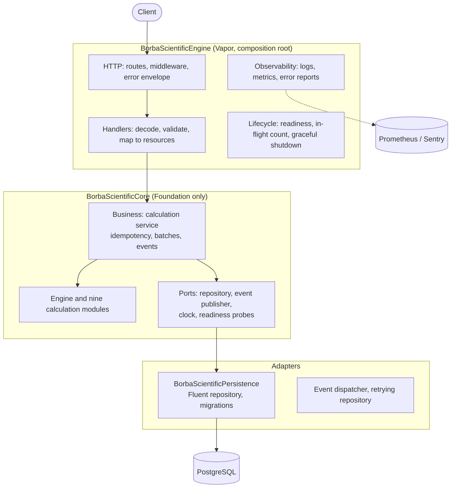

# Architecture

A map of the system: the layers, the targets that hold them, how a request travels and where each concern lives. The reasons
behind each choice are in the [ADRs](../ADR/); this page says what is where.

## Layers

The rule that keeps this honest: **the core imports Foundation and nothing else**, and architecture tests fail the build when
it does. Frameworks reach the core only as implementations of its ports.

## Targets

| Target | Holds | Depends on |
|---|---|---|
| `BorbaScientificCore` | The nine calculation modules, the engine with its cooperative time budget, the calculation history model, the ports, the domain events and the typed error model | Foundation |
| `BorbaScientificPersistence` | The PostgreSQL adapter: Fluent repository, versioned migrations, keyset pagination, idempotency claims, database health | Core, Fluent, PostgresNIO |
| `BorbaScientificEngine` | Configuration, the versioned HTTP API and its OpenAPI-checked contract, request tracing, the event dispatcher, retries, readiness and graceful shutdown, logs, metrics and error reporting, and the composition root | Core, Persistence, Vapor |
| `Run` | `main.swift`: the process entry point, including the `healthcheck` command | Engine |

Calculation modules: arithmetic, percentage, statistics, financial, scientific, conversion, expression, numerical and linear
algebra. A module declares its operations with typed parameters and worked examples; the API's discovery endpoints, its
validation and its documentation are all generated from those declarations (see
[adding a calculation module](../Development/adding-a-calculation-module.md)).

## A request

1. **Middleware** assigns or adopts the request and correlation identifiers, counts the request as in flight, sets the
   security headers and, afterwards, writes the access log and the metrics.
2. **The handler** decodes the body strictly (unknown fields are an error) and validates the parameters against the
   operation's declaration.
3. **The calculation service** claims the idempotency key when there is one, runs the engine under its time budget, records
   the outcome through the repository port and publishes an event.
4. **The repository** writes the calculation, with its trace identifiers, in one transaction.
5. **The response** is the resource, or the single error envelope: a stable code from the catalog, a request identifier and
   details that name the offending field. A calculation that failed for its input is recorded and answered with `422`
   and its identifier.

Failures are values until the edge: the core returns typed results, and only the HTTP layer turns them into statuses
(ADR-003). Infrastructure failures are retried only where repeating is safe.

## Where each concern lives

| Concern | Where | Read |
|---|---|---|
| Module structure, the layering rule | `Sources/`, `Tests/Unit/Architecture` | ADR-001, ADR-002 |
| Errors, codes and statuses | Core error model, `HTTP/Errors` | ADR-003, [error catalog](../API/errors.md) |
| Persistence, migrations, indexes, pagination | `BorbaScientificPersistence` | ADR-004 |
| Concurrency, readiness, graceful shutdown | `Events/`, `Lifecycle/`, `Resilience/` | ADR-005 |
| Logs, metrics, error reports, tracing | `Observability/`, `HTTP/Context` | ADR-006, [observability guide](../Operations/observability.md) |
| Tests and performance | `Tests/` | ADR-007, [testing](../Development/testing.md), [performance](../Development/performance.md) |
| Container and runtime | `Dockerfile`, `docker-compose.yml` | ADR-008, [container guide](../Operations/container.md) |
| Pipelines and deployment | `.github/workflows/`, `Scripts/deploy*` | ADR-009, [deployment guide](../Operations/deployment.md) |
| The HTTP contract | `Documentation/API/openapi.json` | [API guide](../API/README.md) |
| Security assumptions and limits | | [security](../Operations/security.md) |
