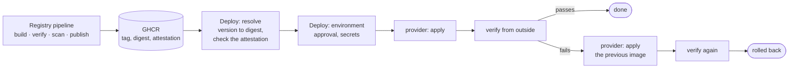

# Deployment

How a published image reaches an environment, what is checked on the way and what happens when it goes wrong. The reasoning
is in [ADR-009](../ADR/ADR-009-ci-cd.md); the container itself is in the [container guide](container.md).

## What is and is not here

The pipeline, the verification and the rollback are real, and they are tested: `make test-deploy` rehearses them against a
real Docker daemon, including a release that does not start and one that starts but does not serve.

**No platform is configured.** This repository does not know where you run the service, so it ships one provider, for a
Docker host running the Compose stack (staging, demonstrations, single-host installations), and a template for the rest.
Until the `DEPLOY_PROVIDER` variable of an environment names one, a deployment is refused and a dry run only reports the
plan. Nothing pretends to have been deployed.



## Running a deployment

From the Actions tab (**Deploy → Run workflow**), or:

```bash
gh workflow run deploy.yml -f environment=staging -f version=v1.2.3 -f dry_run=false
```

| Input | Meaning |
|---|---|
| `environment` | `staging` or `production`. A GitHub environment of that name must exist |
| `version` | A release (`v1.2.3`) or a commit (`sha-1a2b3c4`). `latest` and branch names are refused: they move |
| `dry_run` | Defaults to **true**: resolve the image, check the configuration and report what would change |

Only the workflow on the default branch can deploy, and two deployments to one environment never overlap.

### What the pipeline guarantees

1. **The image exists and was built by this repository's Registry pipeline.** The version is resolved to a digest, and the
   GitHub attestation of that digest is verified against the Registry workflow. Attestations exist for public repositories
   and, for private ones, only on GitHub Enterprise Cloud: on a private repository the pipelines skip them with a warning,
   and nothing verifies where an image was built.
2. **What is deployed is the digest**, not the tag, so what was verified is what runs even if a tag moves.
3. **The environment decides who may deploy and with what.** Approvals, allowed branches, secrets and variables belong to
   the GitHub environment, not to the repository.
4. **The deployment is verified from the outside** ([below](#verification)) and **rolled back when verification fails**.

## Configuration points

Set these in **Settings → Environments → *staging* / *production***:

| Name | Kind | Purpose |
|---|---|---|
| `DEPLOY_PROVIDER` | variable | The platform: a script in `Scripts/deploy/providers/`, such as `compose`. Unset: deployments are refused |
| `DEPLOY_BASE_URL` | variable | Where the deployed service answers; the verification asks it. Also shown on the deployment |
| `DEPLOY_RUNNER` | variable | Optional. Runner labels as JSON, such as `["self-hosted", "staging"]`, when the platform is only reachable from inside its network. Default: GitHub's runners |
| `DEPLOY_ENV_FILE` | secret | A dotenv file with what the provider needs, such as the database credentials. Written with mode 600 for the run and removed after it |

Also in the repository settings, and not in code:

- **Required reviewers** on the `production` environment, so that a person approves each production deployment.
- **Deployment branches** limited to the default branch on both environments.
- **Tag protection** (a ruleset) for `v*`, so that only maintainers can create a release.
- **Required status checks** on the default branch: `Test / Quality gate` and `Build / Build gate`.

Credentials for the platform itself (a kubeconfig, a cloud role) are the provider's business: prefer short-lived
credentials from OIDC over stored secrets, and put whatever remains in the environment's secrets.

## Providers

A provider is a script, `Scripts/deploy/providers/<name>.sh`, with two commands:

| Command | Does |
|---|---|
| `current` | Prints the image reference running now, exactly as it was given to `apply`; nothing when not deployed |
| `apply REFERENCE` | Makes the platform run `REFERENCE` and returns when the platform considers it up; non-zero when it did not get there |

That is all a platform has to offer, because a rollback is a deployment of the previous reference. Verification, the plan
and the rollback are in `Scripts/deploy.sh`, once, for every provider.

- **`compose`** deploys to the Docker host it is run against, local or through `DOCKER_HOST`: it pulls the image when the
  host lacks it, runs the `migrate` job and recreates `app`. It also runs PostgreSQL, so it is not for a managed database.
  The host must be able to pull the image (`docker login ghcr.io` for a private package).
- **To add a platform** copy `_template.sh`, implement the two commands and set `DEPLOY_PROVIDER`. Run the existing
  rehearsal as a model: it only needs a provider that satisfies the contract. A provider whose name starts with an
  underscore, or that is not a plain lowercase name, cannot be selected.

## Verification

`Scripts/verify-deployment.sh` looks at the service the way a client does, and only reads, so it is safe against
production:

- `/ready` answers 200 within the timeout (120 s by default);
- `/version` reports the commit that was deployed;
- `/health` answers 200 and `/api/v1/types` answers with JSON;
- `/ready` and `/health` keep answering for a stability window (15 s by default), which is what catches a crash loop that
  the first request does not.

`--metrics` adds `/metrics`, which is off by default because it is usually kept off the public network.

## Rollback

**Automatic.** When `apply` fails or the verification fails, `Scripts/deploy.sh` applies the reference that was running
before and verifies that. The step then fails anyway, so a rolled-back deployment is never mistaken for a successful one.

| Exit status | Meaning |
|---|---|
| 0 | Deployed and verified |
| 1 | The deployment failed; the previous version is back and verified |
| 2 | Nothing was done: usage or configuration error |
| 3 | The deployment failed and the service could not be restored: **it needs a person now** |

Status 3 also covers a first deployment that fails, because there is nothing to go back to.

**By hand.** Run the workflow again with the version to return to. That is a normal deployment, with the same checks.

**What a rollback does not undo: migrations.** They are forward-only. A rollback puts the previous *code* back over the
*new schema*, so every migration must leave the previous release working: add before you use (new columns nullable or
defaulted, new tables unused by old code), and remove only in a later release, after nothing reads what is removed. A
migration that cannot satisfy this ships alone, and its deployment is a planned event, not a routine one.

## Releasing

```bash
git tag -a v1.0.0 -m "Release 1.0.0"
git push origin v1.0.0
```

The Registry pipeline publishes `v1.0.0` (immutable; it refuses to overwrite one), `v1.0`, and `sha-<commit>`, with
provenance. Deploy it to staging, check, then deploy the same version to production. Update `CHANGELOG.md` first: move
`[Unreleased]` under the version.

## Environments

`APP_ENV` selects defaults; everything can still be overridden by its variable.

| | `development` | `test` | `staging` | `production` |
|---|---|---|---|---|
| Where | A laptop, `make run` / `make up` | Automated tests | Pre-production | Production |
| Log level and format | `debug`, console | `warning`, console | `info`, JSON | `info`, JSON |
| Listens on | `127.0.0.1` | `127.0.0.1` | `0.0.0.0` | `0.0.0.0` |
| Database | The Compose PostgreSQL | One temporary database per test | Its own | Its own |

Sentry reports only when `SENTRY_DSN` is set, in any environment; set it in staging and production. The container image
defaults to `production`. Staging should differ from production in data and scale, not in
configuration: the point of staging is that what it proves carries over.

## Rehearsal

`make test-deploy` runs the deployment tooling against the local Docker daemon, with a local registry. It checks a first
deployment, an upgrade, deploying what already runs, a dry run that changes nothing, the refusal of a missing, unknown,
path-like or template provider, a release pulled by digest, a release that never starts, a release that starts and listens
on the wrong port (so that only the verification from outside can tell), and a first deployment that fails. The Registry
pipeline runs it against the image it is about to publish.

## When something is wrong

| Symptom | Likely cause and what to do |
|---|---|
| `Resolve the image` fails: *could not pull* | The version was never published, or the token cannot read the package. Check **Packages**, and that the Registry pipeline succeeded for that ref |
| *is not a deployable version* | `latest`, a branch or a typo. Use `v1.2.3` or `sha-1a2b3c4` |
| *Verify where the image was built* fails | The image was not built by this repository's Registry pipeline, or its attestation is missing. Do not deploy it; rebuild through the pipeline |
| *no provider is configured* | `DEPLOY_PROVIDER` is not set on the environment. Expected on a fresh clone |
| *unknown provider* | The name does not match a script in `Scripts/deploy/providers/` |
| Verification fails: *becomes ready* | The new version does not start, cannot reach its database or listens elsewhere. `docker logs`, and `/ready`'s body names the failing dependency |
| Verification fails: *the commit that was deployed* | Something other than this release answers on `DEPLOY_BASE_URL`: a stale route, a cache or another environment |
| Exit status 3 | Restore service first: deploy a version known to be good by hand, then find out why the rollback could not |
